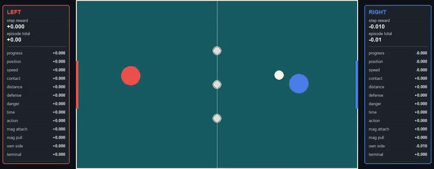

# Klask RL

Klask RL is a small reinforcement-learning playground for the table game Klask.
The board follows the real game: a 40 x 30 cm playing field (1 simulation unit = 20 cm)
with a circular goal hole sunk into each half instead of wall gates. Two handles move on
their own halves of the board and try to send the ball into the opposite hole. A point
ends the episode when the ball drops into either hole (the hole's owner concedes, own
goals included), when a handle falls into its own hole ("klask"), or when two of the
three magnetic biscuits attach to a handle.

The repository contains:

- a Pymunk physics simulator with pygame rendering;
- PettingZoo and Gymnasium environments;
- Stable-Baselines3 PPO self-play training;
- benchmark scripts for comparing checkpoints;
- a simple model-vs-model and human-vs-model viewer.

## Demo

Five self-play episodes recorded from the current PPO leader:



[Open the MP4 version](docs/assets/klask-self-play-5-episodes.mp4)

The red and blue circles are the handles, the white circle is the puck, and the small gray
circles are the magnets. The dark circles near each end are the goal holes; a biscuit that
slides into a hole stays there, inert, until the next reset. The side panels show the
current step reward, episode total, and every reward component for each side.

Note: the demo video above was recorded on the older board that still used wall gates
instead of goal holes; the checkpoint also predates the hole-based rules.

## Setup

Use Python 3.11 or newer. The project is managed with `uv`.

```bash
uv sync
uv run pytest
```

`ffmpeg` is only required if you want to record new videos.

## Download Demo Model

The trained demo policy is the best checkpoint from the completed 50M-step PPO run. It is
published as a GitHub Release asset, not committed to git.
Download it into the path used by the commands below:

```bash
mkdir -p runs/klask/latest
curl -L -o runs/klask/latest/simple_leader.zip \
  https://github.com/lenant/klask-rl/releases/download/v0.1-demo/simple_leader.zip
```

## Watch A Model

Trained checkpoints and logs are generated artifacts and are ignored by git. The commands
below expect a model at `runs/klask/latest/simple_leader.zip`, either from the release
download above or from a local training run.

Model vs model:

```bash
uv run klask-watch --model runs/klask/latest/simple_leader.zip --self-play --reward-profile simple
```

Human vs model:

```bash
uv run klask-play --model runs/klask/latest/simple_leader.zip --human-side left --reward-profile simple
```

Controls in human mode:

- `W`, `A`, `S`, `D` move the human handle.
- `Space` pauses and resumes the episode.
- `Escape` or closing the window exits.

## Train

For a quick smoke run:

```bash
uv run klask-train --total-steps 10000 --num-envs 2 --n-steps 128 \
  --batch-size 128 --snapshot-freq 5000 --reward-profile simple
```

The current stronger setup uses a larger PPO network, behavior-cloning warm start, parallel
self-play environments, simple reward, and automatic snapshots:

```bash
uv run klask-train --total-steps 50000000 --num-envs 16 --n-steps 1024 \
  --batch-size 1024 --snapshot-freq 100000 --max-steps 450 \
  --reward-profile simple --bc-samples 12000 --bc-epochs 8 \
  --bc-batch-size 512 --vec-env subproc --device cuda \
  --policy-net-arch 256x256x256 \
  --output-dir runs/remote_simple_ppo_256x3_50m
```

Use `--device cpu` or `--device auto` on machines without CUDA.

Training writes checkpoints under:

- `runs/.../latest/final_model.zip`
- `runs/.../latest/snapshots/policy_<step>.zip`
- `runs/.../tensorboard/`

## Evaluate

Evaluate against one opponent:

```bash
uv run klask-eval --model runs/klask/latest/simple_leader.zip \
  --opponent heuristic --episodes 30 --reward-profile simple
```

Run the built-in benchmark suite:

```bash
uv run klask-benchmark --model runs/klask/latest/simple_leader.zip \
  --episodes 20 --reward-profile simple
```

`klask-benchmark` tests passive, random, heuristic, and self-play matchups. The aggregate
quality score combines attack, defense, contact activity, territory, and decisiveness.

During long training runs, benchmark snapshots automatically and keep only new leaders:

```bash
PYTHONPATH=src uv run python scripts/benchmark_snapshots.py \
  --snapshot-dir runs/remote_simple_ppo_256x3_50m/latest/snapshots \
  --csv runs/remote_simple_ppo_256x3_50m/benchmark_results.csv \
  --leader-dir runs/remote_simple_ppo_256x3_50m/leaders \
  --leader-copy runs/klask/latest/simple_leader.zip \
  --episodes 20 --reward-profile simple
```

The best checkpoint from the completed 50M-step run used `--policy-net-arch 256x256x256`
with the simple reward profile. The top evaluated leader was the 15M-step checkpoint:
aggregate quality `5.600`, with `32` goals for and `3` goals against across the four
20-episode benchmark matchups.

## Reward Profile

The current recommended training profile is `simple`. Pass it explicitly to training,
because the training CLI still defaults to the older `possession` profile.

`simple` gives:

- `+12 / -12` terminal reward for scoring or conceding;
- `-2.0` once when a new magnet attaches to the handle;
- up to `-0.05` per step while an unattached magnet is pulling toward the handle, scaled by
  closeness;
- `-0.01` per step while the puck is on the player's own side;
- `0` reward when the puck is on the other side, unless one of the rules above applies.

Older reward profiles remain in the code for experiments:

| Profile | What it encourages |
| --- | --- |
| `balanced` | Original dense shaping profile. It mixes puck progress, puck position, puck speed, puck contact, distance to the puck, defensive alignment, own-goal danger, small magnet penalties, time cost, and action cost. Useful as a general baseline, but it can reward many small behaviors that do not always translate into better scoring. |
| `aggressive` | More attack-heavy dense shaping. It increases terminal goal reward, forward progress, puck position, puck speed, contact, and puck-distance rewards, while reducing defense, time, and action penalties. It tends to produce policies that chase the puck and try to move it forward quickly, sometimes at the cost of protecting their own goal. |
| `defensive` | More safety-heavy dense shaping. It increases terminal goal reward, defensive alignment, and own-goal danger penalties, while reducing forward-progress and puck-speed incentives. It is useful when policies concede too easily, but can become too passive if the defensive terms dominate. |
| `possession` | Dense shaping tuned to stay involved with the puck. It strongly rewards contact and staying close to the puck, with moderate progress, speed, and defense terms and lower time/action costs. This was the previous default before the simpler magnet-aware reward. |

The older profiles use continuous shaping rewards and small ongoing penalties for magnet
attachment/proximity. The `simple` profile is easier to reason about because it mostly
rewards the actual game outcome and penalizes concrete bad situations: getting a magnet,
being pulled by a magnet, and letting the puck stay on your own side.

## Model Inputs

Both sides use the same policy. Observations are mirrored so the learning side always sees
itself as playing left to right.

The observation vector has 33 floats:

- own handle position and velocity;
- opponent handle position and velocity;
- puck position, velocity, and relative vector from the own handle;
- score difference and time remaining;
- for each of the three magnets: position, velocity, and attachment state;
- own and opponent magnet attachment counts.

The action is a 2D continuous vector in `[-1, 1]` that controls handle movement.

The current leader uses Stable-Baselines3 PPO with an `MlpPolicy` and hidden layers
`256x256x256` for the policy and value networks.

## Record A Demo

Record five model-vs-model episodes to an MP4:

```bash
PYTHONPATH=src uv run python scripts/record_demo.py \
  --model runs/klask/latest/simple_leader.zip \
  --output docs/assets/klask-self-play-5-episodes.mp4 \
  --episodes 5 --reward-profile simple
```

## Project Layout

- `src/klask_rl/physics.py` contains the board physics and renderer.
- `src/klask_rl/envs.py` contains the PettingZoo and Gymnasium environments.
- `src/klask_rl/cli.py` contains training, evaluation, watch, benchmark, and play commands.
- `src/klask_rl/opponents.py` contains passive, random, heuristic, striker, and checkpoint opponents.
- `src/klask_rl/training.py` contains the behavior-cloning warm start.
- `scripts/benchmark_snapshots.py` evaluates snapshots and copies new leaders.
- `scripts/record_demo.py` records self-play videos.
